# MOFEにおけるWriter作業のやり方

## 問題の管理画面の開き方

ログインしていれば、トップページのコンテスト一覧の最下部に「問題の管理画面へ」というボタンが現れていると思います。これを押します。

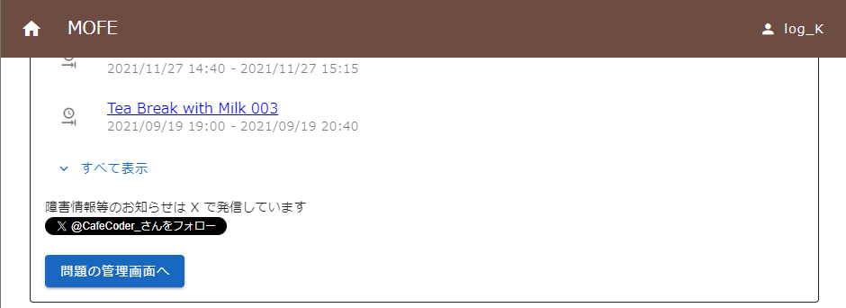

そうするとこんな感じのページに飛ばされます。
新しい問題を作成するときは、右上の「問題を作成」ボタンを押します。
既存の問題を編集する場合は、各問題の右の鉛筆マークを押します。（ここでは新しい問題を作成する体で説明します）

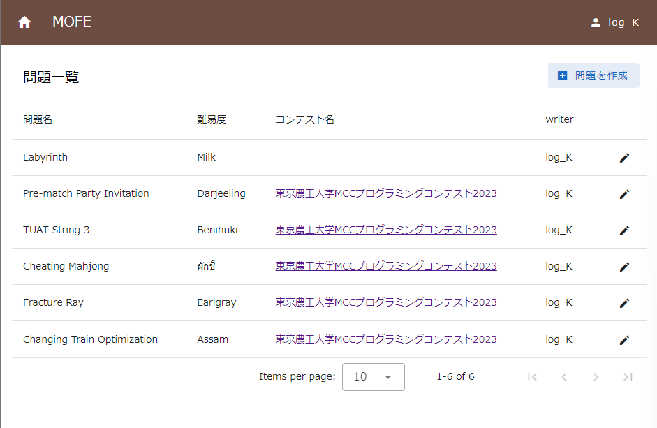

## 問題の作成方法

こんなページに飛ぶので、問題名、難易度などを入れます。後で編集も可能です。

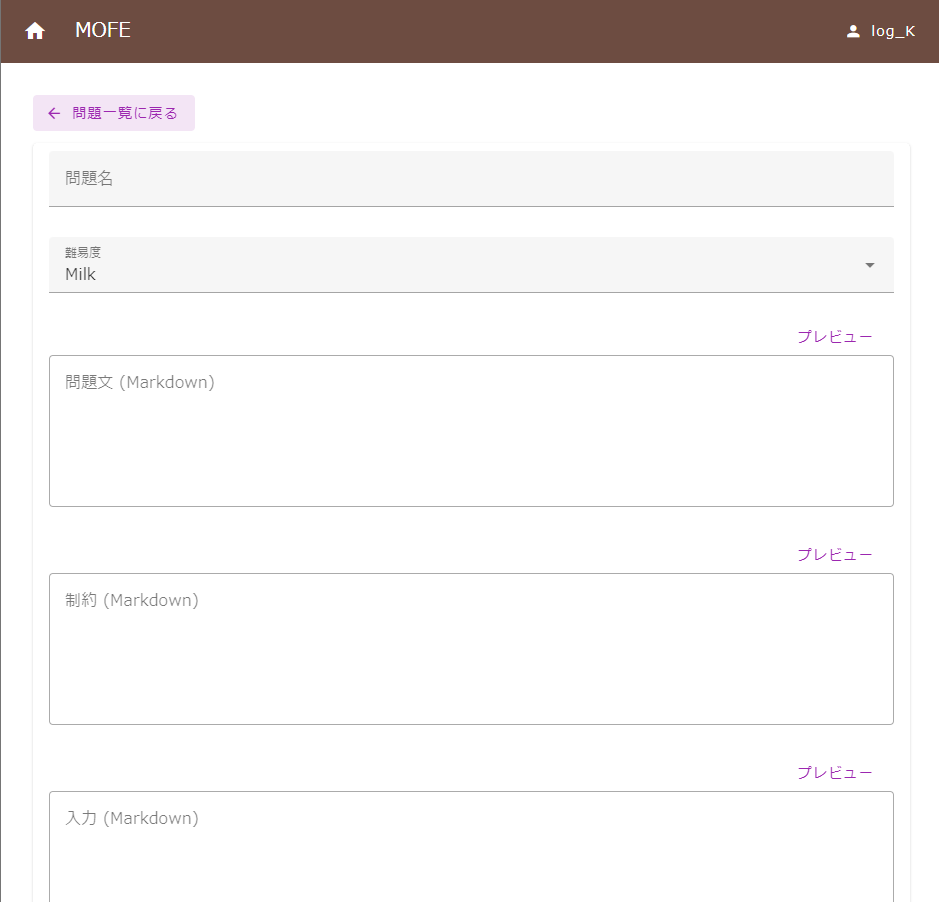

試しにYellow Birdの問題を作成してみます。

問題文・制約・入力・出力それぞれに入力欄が用意されています。なお、**サンプルの説明はテストケースの追加画面に入力欄があります**。

実際に入力してみるとこんな感じになります。

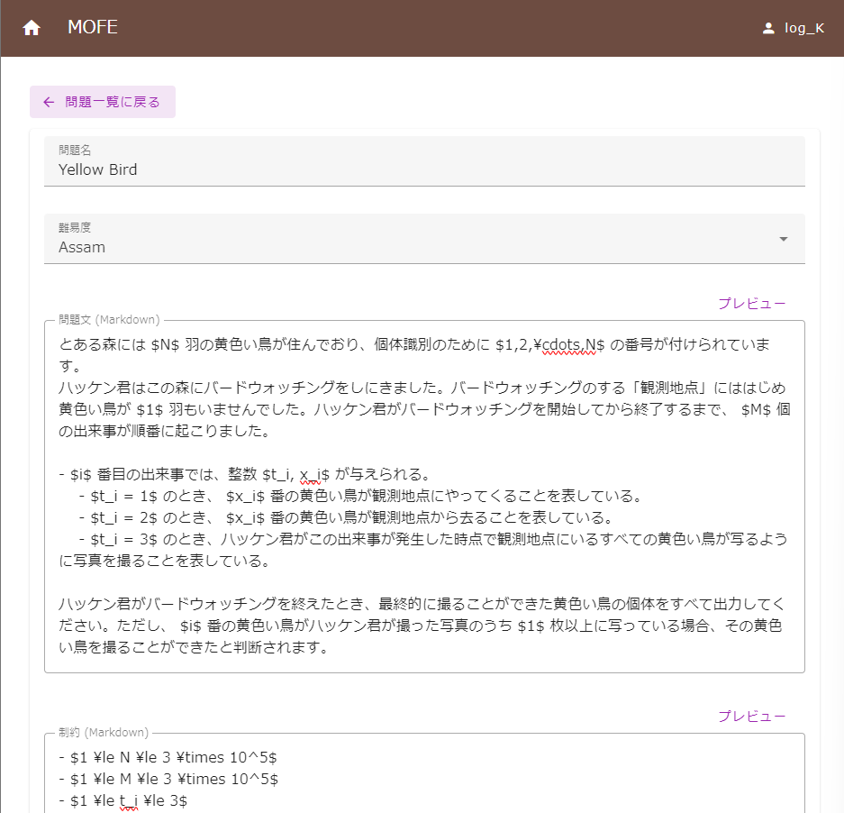

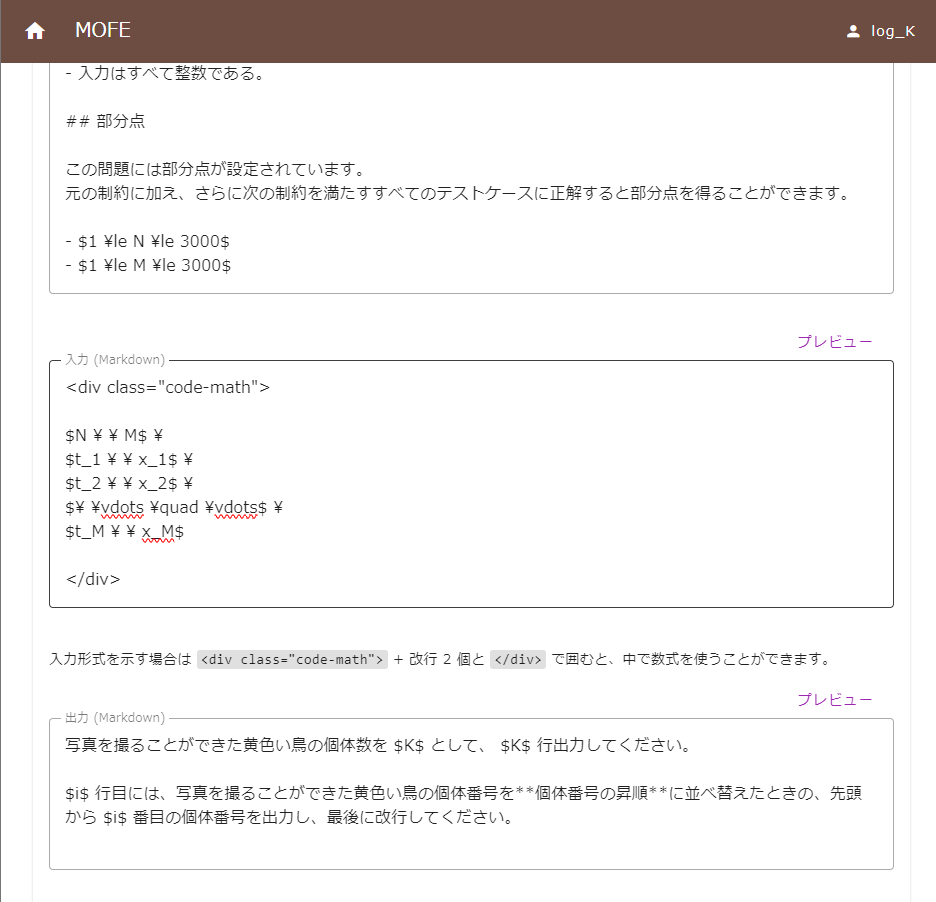

入力が終わったら一番下の「登録」を押します。

## テストケースを追加する

再度編集してみると「テストケース」「ジャッジ」「表示確認」のタブが増えます。

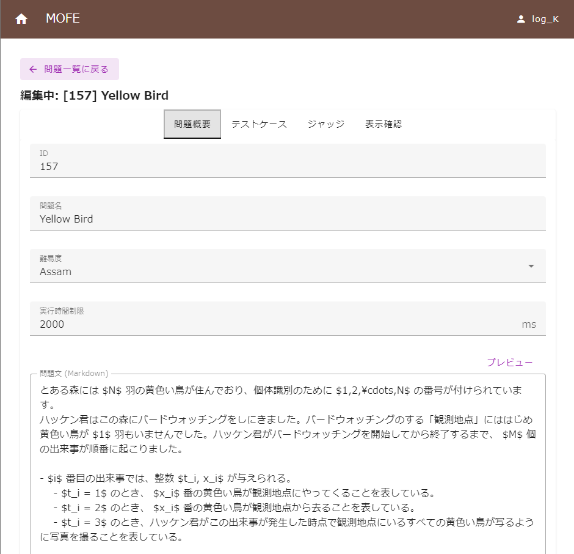

テストケースのタブを開くとこんな感じの画面が出ます。

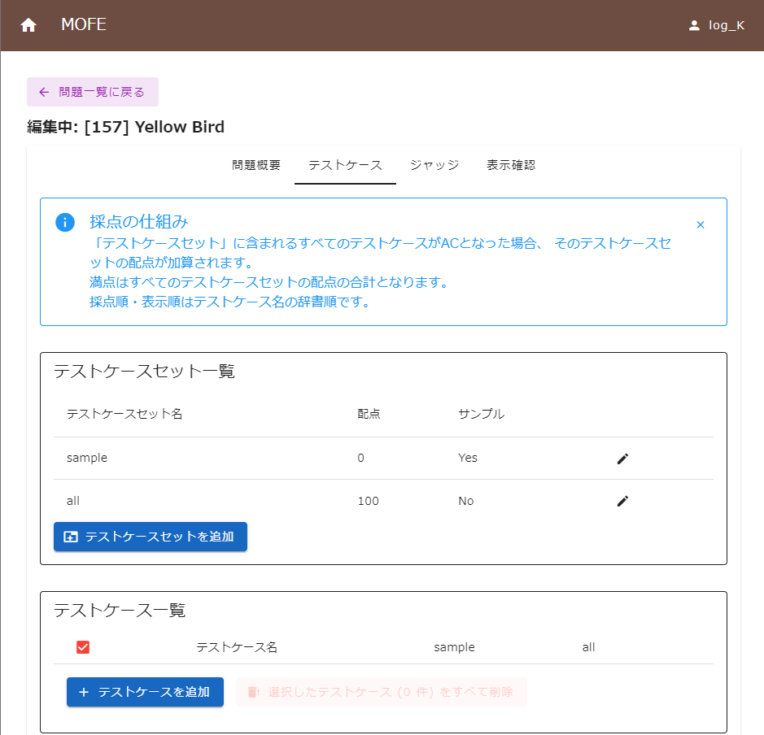

部分点のある問題はテストケースセットを新しく追加しましょう。Yellow Birdには部分点のセットがあるので追加します。

テストケースの追加方法は、手動で1ケースごとに追加することも、まとめてアップロードすることもできます。
アップロードの方法は書いてあるので読めばわかります。

手動で追加する場合、次のような画面が出るので必要事項を書きましょう。サンプルなどの説明もここに書きます。

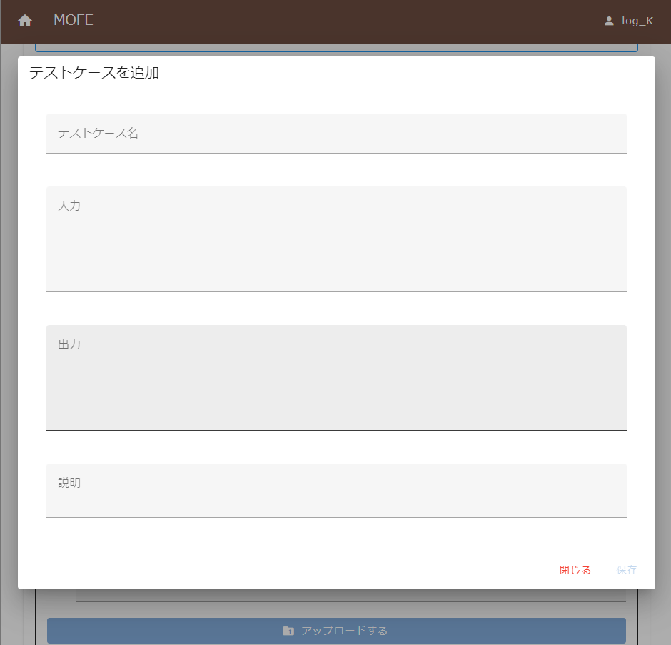

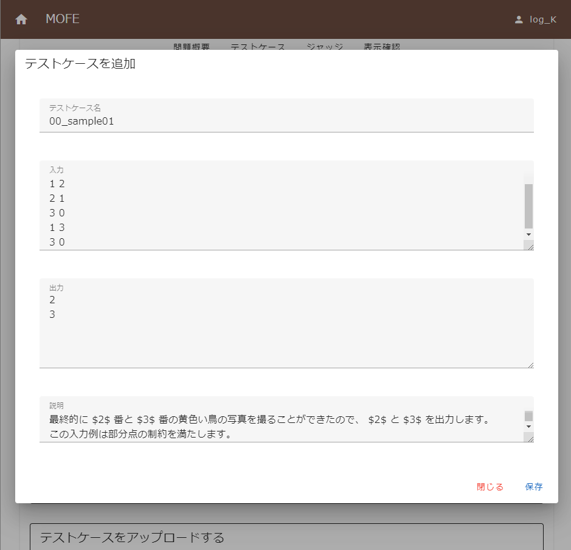

追加したテストケースはこんな感じに表示され、ここでどのテストケースセットに含めるかも指定できます。

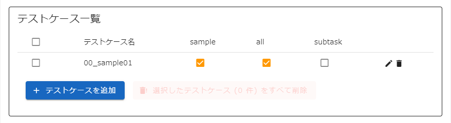

## プレビューとTesterの追加

表示確認タブでプレビューを見ることができます。

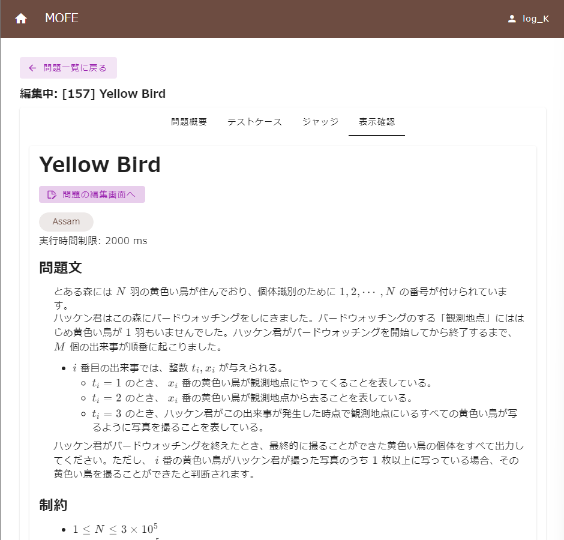

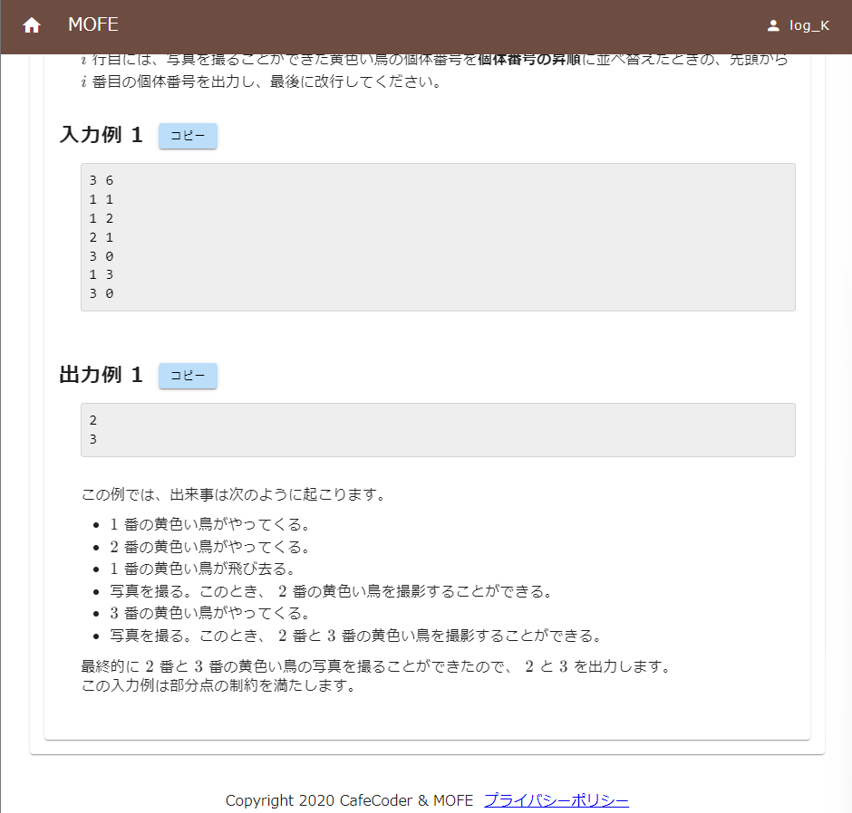

Testerは「問題概要」タブの一番下から追加できます。

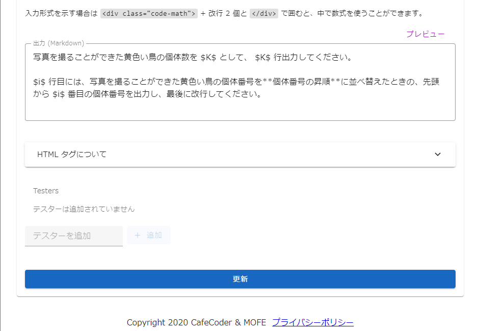

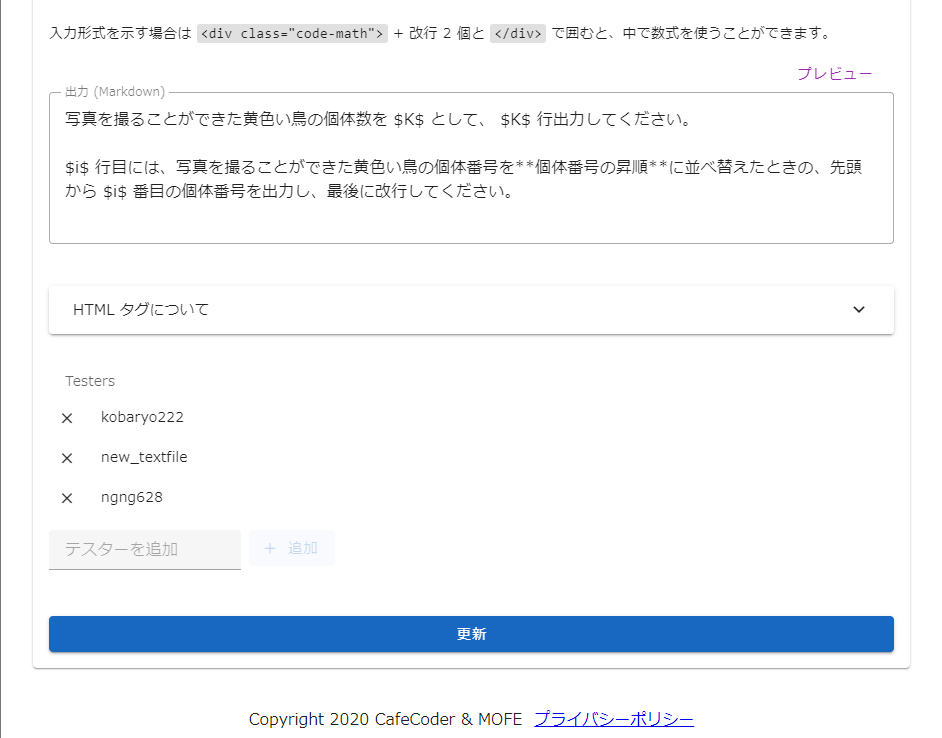